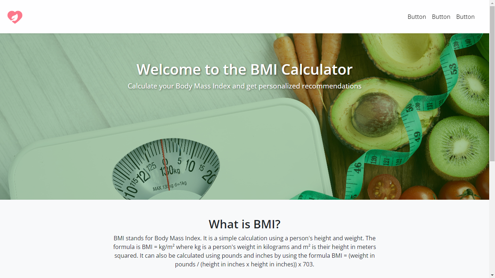

# BMI-Calculator-Page

The **BMI Calculator** is a web application that allows users to calculate their Body Mass Index (BMI) and receive personalized recommendations based on their BMI results. This project is designed with a user-friendly interface and provides accurate calculations using a simple form where users can input their height and weight.

## Features

- **BMI Calculation:** Users can input their height and weight to calculate their BMI.
- **Personalized Recommendations:** Based on the calculated BMI, users receive personalized health recommendations.
- **Responsive Design:** The application is fully responsive, providing an optimal user experience on both desktop and mobile devices.
- **Secure User Input:** Ensures secure handling of user data with validation and error handling.

## Technologies Used

### Frontend

- HTML
- CSS
- Bootstrap
- JavaScript
- jQuery

### Backend

- None required for this project. All calculations are performed client-side.

## Usage

1. Open the BMI Calculator in your web browser.
2. Enter your height and weight in the designated fields.
3. Select the appropriate units for height and weight (meters, centimeters, inches for height; kilograms, pounds for weight).
4. Click the "Calculate" button to see your BMI and receive personalized recommendations.

## Customization

Feel free to customize this project to suit your needs. You can modify the styles, add new features, or integrate it with a backend server if necessary.

## License and Reuse

This project is open for reuse and modification. You are welcome to use it for personal projects, educational purposes, or commercial use. If you find this project helpful, I would appreciate it if you could give it a star on GitHub or mention my work. Your support helps me continue developing and sharing more projects.

## Acknowledgements

- Icons and images used in this project are the property of their respective owners.
- Thanks to the open-source community for providing valuable resources and inspiration.

## Contact

If you have any questions or need further assistance, feel free to contact me at:

- **Email:** longaricivan@gmail.com
- **Phone:** +591 78644946
